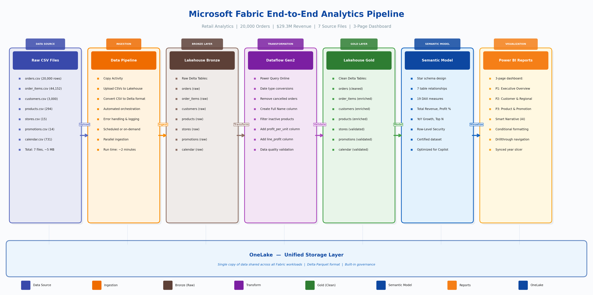
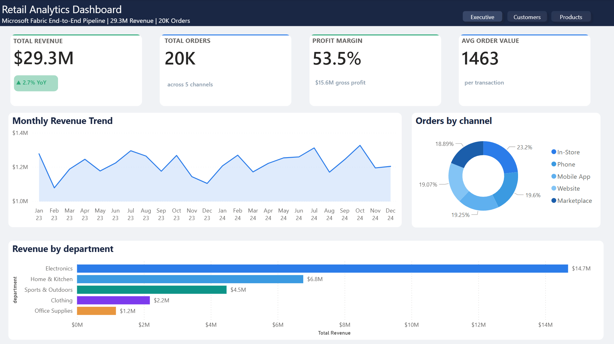
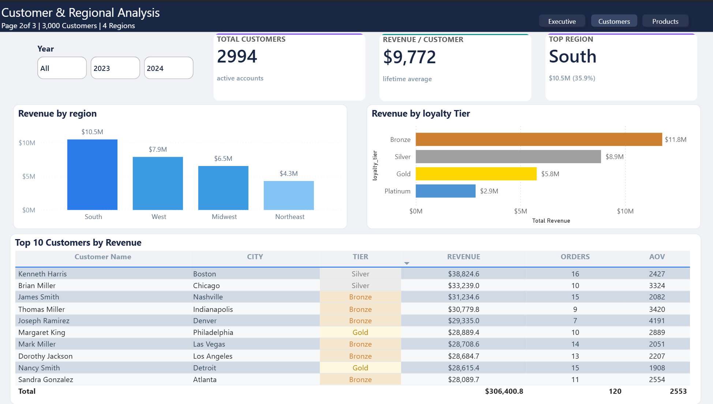
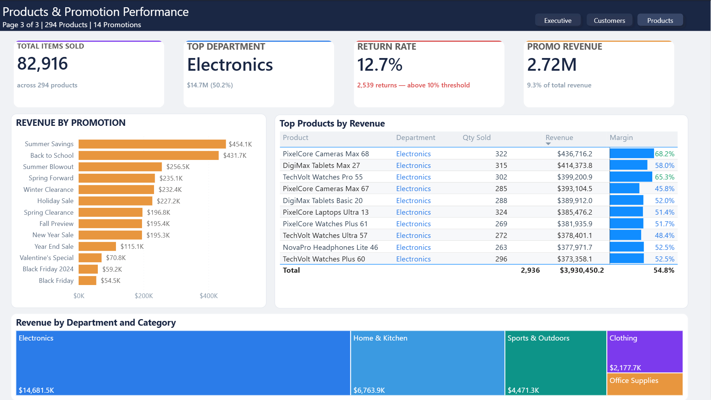

# Microsoft Fabric End-to-End Analytics Pipeline  
## Overview 
Complete end-to-end analytics solution on Microsoft Fabric. 20,000 orders ($29.3M revenue) processed through Lakehouse, Data Pipelines, Dataflows Gen2, star schema modeling, and Power BI visualization.  
## Pipeline Architecture  
## Data 
| Table | Rows | Description | 
|-------|------|-------------| 
| orders | 20,000 | Customer orders (2023-2024) | 
| order_items | 44,152 | Line-item details | 
| customers | 3,000 | Customer profiles | 
| products | 294 | Products across 5 departments | 
| stores | 15 | Physical retail locations | 
| promotions | 14 | Sales promotions | 
| calendar | 731 | Date dimension |  
## Pipeline Stages 
### 1. Ingestion CSV files uploaded to Lakehouse Files, converted to Delta tables via Data Pipeline Copy Activity.   
### 2. Transformation Dataflow Gen2: type conversion, filtering inactive records, calculated columns (full_name, profit_per_unit, line_profit).   
### 3. Star Schema  
### 4. Power BI Reports

### Page 1: Executive

### Page 2: Customers

### Page 3: Products

## Key Metrics 
- Revenue: $29.3M | Orders: 20K | Avg Order: ~$1,579 
- 5 departments, 15 stores, 5 sales channels 
- 14 promotional campaigns analyzed

## Tools & Technologies 
- Microsoft Fabric (Lakehouse, Pipelines, Dataflows Gen2, OneLake) 
- Power BI (semantic model, DAX, multi-page reports) 
- Star schema with snowflake extension
  
## Documentation 
- [Design Decisions](docs/pipeline-design-decisions.md) 
- [DAX Measures](docs/dax-measures-catalog.md)
